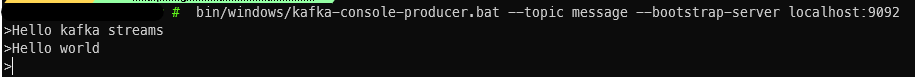
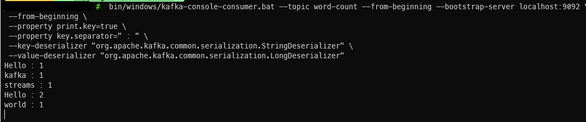

#  Kafka Streams
For learning kafka streams basics

---

## Working Steps

#### 1. Run the java application in this path

---

#### 2. Run zookeeper

Windows:
```shell
bin/windows/zookeeper-server-start.bat config/zookeeper.properties
```

Linux:
```shell
bin/zookeeper-server-start.sh config/zookeeper.properties
```

---

#### 3. Run kafka

Windows:
```shell
bin/windows/kafka-server-start.bat config/server.properties
```

Linux:
```shell
bin/kafka-server-start.sh config/server.properties
```

---

#### 4. Add topics

Windows: 
```shell
bin/windows/kafka-topics.bat --create --topic message --bootstrap-server localhost:9092
```
```shell
bin/windows/kafka-topics.bat --create --topic word-count --bootstrap-server localhost:9092
```

Linux:
```shell
bin/kafka-topics.sh --create --topic message --bootstrap-server localhost:9092
```
```shell
bin/kafka-topics.sh --create --topic word-count --bootstrap-server localhost:9092
```

---

#### 5. Run kafka producer

Windows:
```shell
bin/windows/kafka-console-producer.bat --topic message --bootstrap-server localhost:9092
```

Linux:
```shell
bin/kafka-console-producer.sh --topic message --bootstrap-server localhost:9092
```

---

#### 6. Run kafka consumer

Windows:
```shell
bin/windows/kafka-console-consumer.bat --topic word-count --from-beginning --bootstrap-server localhost:9092 \
 --from-beginning \
 --property print.key=true \
 --property key.separator=" : " \
 --key-deserializer "org.apache.kafka.common.serialization.StringDeserializer" \
 --value-deserializer "org.apache.kafka.common.serialization.LongDeserializer"
```

Linux:
```shell
bin/kafka-console-consumer.sh --topic word-count --from-beginning --bootstrap-server localhost:9092 \
 --from-beginning \
 --property print.key=true \
 --property key.separator=" : " \
 --key-deserializer "org.apache.kafka.common.serialization.StringDeserializer" \
 --value-deserializer "org.apache.kafka.common.serialization.LongDeserializer"
```

---

## Results Images

<p float="left">
   
</p>
<p float="left">
   
</p>